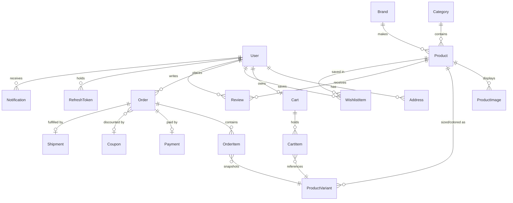

# M1 Stores — Database Design

EF Core code-first. Same model runs on SQL Server (local dev) and PostgreSQL (production).

## Design decisions

- **Guid v7 primary keys** — non-guessable in URLs, sequential enough for index health.
- **Soft deletes** (`IsDeleted` + global query filter) on Products and Users — order
  history must survive a product being retired.
- **Money** — `decimal(18,2)` + `Currency` (ISO 4217, default `KES`). Order lines snapshot
  `UnitPrice` at purchase time: later price changes must not rewrite history.
- **One cart per user**, enforced by unique index. Guest carts live in localStorage until login.
- **Stock** is decremented transactionally at order placement, restored on cancellation.
- **Reviews**: one per user per product (unique index), only after a delivered order
  (verified-purchase flag).
- **RefreshTokens** stored hashed, with `ReplacedByTokenHash` chain for rotation auditing.

## ER Diagram

## Tables

### Identity & people
| Table | Key columns | Notes |
|---|---|---|
| **Users** | Id, Email (unique), PasswordHash, FullName, Role (`Customer`/`Admin`), EmailVerifiedAt, GoogleId?, AvatarUrl?, IsDeleted, CreatedAt | Role as enum column — two roles don't justify a join table |
| **Addresses** | Id, UserId FK, Label, Line1, City, County, Phone, IsDefault | Kenya-friendly: county instead of state, phone required for delivery |
| **RefreshTokens** | Id, UserId FK, TokenHash, ExpiresAt, RevokedAt?, ReplacedByTokenHash? | Hashed at rest |
| **EmailTokens** | Id, UserId FK, TokenHash, Purpose (`VerifyEmail`/`ResetPassword`), ExpiresAt, UsedAt? | Single-use, 24h/1h expiry |

### Catalog
| Table | Key columns | Notes |
|---|---|---|
| **Categories** | Id, Name, Slug (unique), ParentId? | Self-reference: Shoes → Sneakers |
| **Brands** | Id, Name, Slug (unique), LogoUrl? | |
| **Products** | Id, CategoryId FK, BrandId FK?, Name, Slug (unique), Description, BasePrice, Currency, IsFeatured, IsDeleted, AvgRating (denormalized), ReviewCount, CreatedAt | AvgRating updated on review write — read-heavy listing pages shouldn't aggregate on every request |
| **ProductVariants** | Id, ProductId FK, Sku (unique), Size?, Color?, PriceOverride?, Stock | A shoe in 3 sizes = 3 variants sharing one product page |
| **ProductImages** | Id, ProductId FK, Url, AltText, SortOrder, IsPrimary | |

### Shopping
| Table | Key columns | Notes |
|---|---|---|
| **Carts** | Id, UserId FK (unique), UpdatedAt | |
| **CartItems** | Id, CartId FK, VariantId FK, Quantity | Unique (CartId, VariantId) |
| **WishlistItems** | Id, UserId FK, ProductId FK, CreatedAt | Unique (UserId, ProductId) |
| **Coupons** | Id, Code (unique), Type (`Percent`/`Fixed`), Value, MinOrderTotal?, MaxUses, UsedCount, ExpiresAt, IsActive | |

### Orders & fulfilment
| Table | Key columns | Notes |
|---|---|---|
| **Orders** | Id, OrderNumber (unique, human-readable e.g. `M1-2026-000123`), UserId FK, Status, Subtotal, DiscountAmount, ShippingFee, Total, Currency, CouponId?, ShippingAddress (owned/JSON snapshot), PlacedAt | Status: `PendingPayment → Paid → Processing → Shipped → Delivered` / `Cancelled` / `Refunded` |
| **OrderItems** | Id, OrderId FK, VariantId FK, ProductName, VariantLabel, UnitPrice, Quantity, LineTotal | Name/price snapshotted |
| **Payments** | Id, OrderId FK, Provider (`Mpesa`/`Stripe`), ProviderRef, Amount, Status, CreatedAt | One row per attempt |
| **Shipments** | Id, OrderId FK, Carrier, TrackingNumber?, ShippedAt?, DeliveredAt? | |

### Engagement
| Table | Key columns | Notes |
|---|---|---|
| **Reviews** | Id, ProductId FK, UserId FK, Rating 1–5, Title, Body, IsVerifiedPurchase, CreatedAt | Unique (ProductId, UserId) |
| **Notifications** | Id, UserId FK, Type, Title, Body, IsRead, CreatedAt | Order updates, promos |

## Seed data

Roles are implicit (enum). Seeded: 1 admin user (credentials via env), 5 root categories
(Shoes, Handbags, Cosmetics, Jewelry, Accessories), 8 brands, ~24 demo products with
variants and Cloudinary-hosted images so the live demo looks like a real store on day one.
